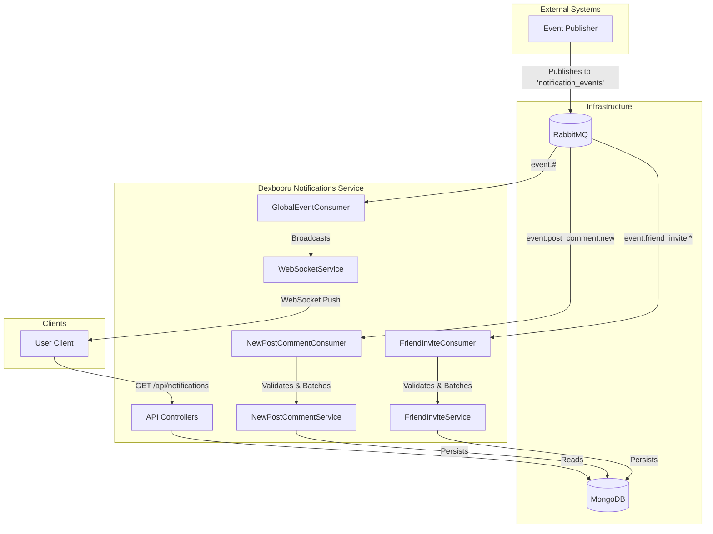

# dexbooru-notifications

A real-time notification microservice for the Dexbooru platform, built with Bun, TypeScript, RabbitMQ, and MongoDB.

## Purpose

This service handles the ingestion, persistence, and real-time delivery of notifications and events to users. It consumes events from a RabbitMQ message broker, stores relevant persistent data (like friend invites) in MongoDB, and broadcasts events to connected clients via WebSockets.

## Tech Stack

- **Runtime**: [Bun](https://bun.com) (v1.3.3+)
- **Language**: TypeScript
- **Database**: MongoDB (via Mongoose)
- **Message Broker**: RabbitMQ
- **Validation**: Zod
- **Testing**: Bun Test

## Setup

### Prerequisites

- [Bun](https://bun.com/docs/installation) installed.
- Docker & Docker Compose (optional, for running dependencies).

### 1. Install Dependencies

```bash
bun install
```

### 2. Environment Configuration

Copy the example environment file and configure it:

```bash
cp .env.example .env
```

Ensure your `.env` file points to valid MongoDB and RabbitMQ instances.

### 3. Run Dependencies (Docker)

If you don't have local instances of MongoDB and RabbitMQ, you can use the provided `docker-compose.yml`:

```bash
docker-compose up -d
```

### 4. Run the Application

**Development Mode (with hot reload):**
```bash
bun run dev
```

**Production Build:**
```bash
bun run build
bun start # or run the generated ./dist/index.js
```

### 5. Running Tests

```bash
bun test
```

## Architecture & Data Flow

The system uses a consumer-based architecture to process events.

1.  **Producers** publish events to the `notification_events` exchange in RabbitMQ.
2.  **Consumers** (running in this service) subscribe to specific routing keys.
    - `FriendInviteConsumer`: Listens for friend invites, validates them, and persists them to MongoDB.
    - `NewPostCommentConsumer`: Listens for new post comments, validates them, and persists them to MongoDB.
    - `GlobalEventConsumer`: Listens for all events (`event.#`) and broadcasts them to relevant WebSocket clients.
3.  **Clients** connect via WebSocket to receive real-time updates.



## Project Structure

- `src/api`: REST API controllers.
- `src/consumers`: RabbitMQ message consumers.
- `src/core`: Core logic (Middleware, Base classes, DI Container, Logger).
- `src/models`: Mongoose models and Zod schemas.
- `src/repositories`: Data access layer.
- `src/services`: Business logic.
- `tests`: Unit and integration tests.

## Contributing

Contributions are welcome! To contribute, please follow these steps:

1.  **Fork** the repository.
2.  **Create a new branch** for your feature or bugfix: `git checkout -b feature/your-feature-name`.
3.  **Make your changes** and ensure they adhere to the project's coding standards.
4.  **Write and run tests** to verify your changes: `bun test`.
5.  **Commit your changes** with a descriptive message.
6.  **Push your branch** to your fork: `git push origin feature/your-feature-name`.
7.  **Open a Pull Request** against the `main` branch.

Please ensure that your code follows the existing architectural patterns and that all new features include appropriate unit tests.